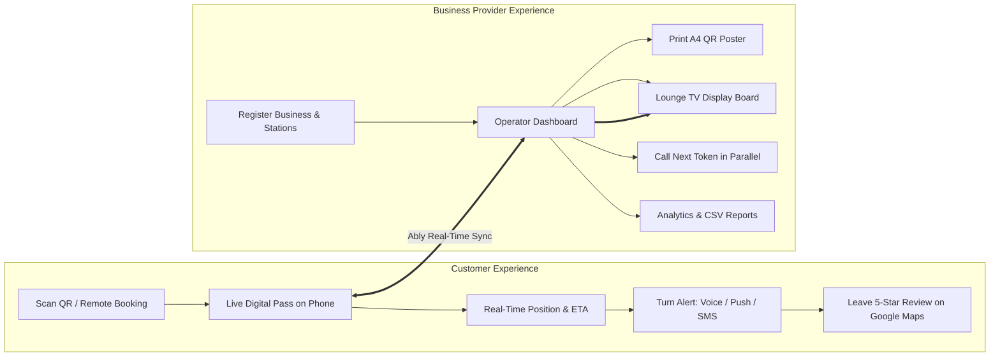

# 📘 noQ — Persona-Based Feature List & Layman User Guide

> **Official Live App**: [https://noq-serve.vercel.app/](https://noq-serve.vercel.app/)  
> **Platform Type**: Zero-Hardware Intelligent Virtual Queue & Crowd Flow Engine

---

## 🌟 Table of Contents

- [1. Introduction & Overview](#1-introduction--overview)
- [2. Persona 1: Customer / Patient / Guest Experience](#2-persona-1-customer--patient--guest-experience)
  - [Feature C1: Instant On-Site QR Scan & Fast Check-In](#feature-c1-instant-on-site-qr-scan--fast-check-in)
  - [Feature C2: Zero-Install Mobile Live Digital Pass (`/t/[tokenId]`)](#feature-c2-zero-install-mobile-live-digital-pass-ttokenid)
  - [Feature C3: Remote Web Booking & Future Time Slot Scheduling (`/book/[streamId]`)](#feature-c3-remote-web-booking--future-time-slot-scheduling-bookstreamid)
  - [Feature C4: Lock-Screen Push & Multi-Channel Turn Alerts](#feature-c4-lock-screen-push--multi-channel-turn-alerts)
  - [Feature C5: Dynamic Wait Times, Spots Ahead & Overrun Warnings](#feature-c5-dynamic-wait-times-spots-ahead--overrun-warnings)
  - [Feature C6: Self-Serve Cancellation & Reschedule Requests](#feature-c6-self-serve-cancellation--reschedule-requests)
  - [Feature C7: 5-Star Feedback & Automated Google Maps Review Redirection](#feature-c7-5-star-feedback--automated-google-maps-review-redirection)
  - [Feature C8: Privacy & Data Protection for Visitors](#feature-c8-privacy--data-protection-for-visitors)
  - [🚶 Customer Step-by-Step Journey Walkthrough](#-customer-step-by-step-journey-walkthrough)
- [3. Persona 2: Business Provider / Doctor / Operator Experience](#3-persona-2-business-provider--doctor--operator-experience)
  - [Feature B1: Business Account Auth & Cross-Device Access (`/login` & `/signup`)](#feature-b1-business-account-auth--cross-device-access-login--signup)
  - [Feature B2: 60-Second Instant Onboarding & Station Setup](#feature-b2-60-second-instant-onboarding--station-setup)
  - [Feature B3: Central Operator Terminal & Mobile-Optimized Calling Dashboard (`/dashboard`)](#feature-b3-central-operator-terminal--mobile-optimized-calling-dashboard-dashboard)
  - [Feature B4: Multi-Doctor & Multi-Station Parallel Calling Engine](#feature-b4-multi-doctor--multi-station-parallel-calling-engine)
  - [Feature B5: Smart Waitlist & Fair Priority Latecomer Recall (`/dashboard/waitlist`)](#feature-b5-smart-waitlist--fair-priority-latecomer-recall-dashboardwaitlist)
  - [Feature B6: Reschedule Request Approval & Rejection Hub](#feature-b6-reschedule-request-approval--rejection-hub)
  - [Feature B7: Multi-Branch Clinic Linkage & Patient Transfer Network](#feature-b7-multi-branch-clinic-linkage--patient-transfer-network)
  - [Feature B8: Lounge TV Display Board with Voice Announcements (`/display/[streamId]`)](#feature-b8-lounge-tv-display-board-with-voice-announcements-displaystreamid)
  - [Feature B9: Print-Ready A4 Venue QR Poster Generator (`/dashboard/poster`)](#feature-b9-print-ready-a4-venue-qr-poster-generator-dashboardposter)
  - [Feature B10: Live Broadcast Announcements & Delay Tickers](#feature-b10-live-broadcast-announcements--delay-tickers)
  - [Feature B11: Direct WhatsApp Messaging & Manual Walk-in Registry](#feature-b11-direct-whatsapp-messaging--manual-walk-in-registry)
  - [Feature B12: Operations Analytics, Heatmaps & CSV Data Export (`/dashboard/analytics`)](#feature-b12-operations-analytics-heatmaps--csv-data-export-dashboardanalytics)
  - [Feature B13: Dynamic Industry Lexicon & Domain Terminology Adapter](#feature-b13-dynamic-industry-lexicon--domain-terminology-adapter)
  - [Feature B14: Terminal Security, PIN Locks & Cryptographic Session Tokens](#feature-b14-terminal-security-pin-locks--cryptographic-session-tokens)
  - [Feature B15: Subscription Monetization, Grace Policy & Auto-Lock](#feature-b15-subscription-monetization-grace-policy--auto-lock)
  - [Feature B16: Automated Daily Queue Reset with Opening Buffer](#feature-b16-automated-daily-queue-reset-with-opening-buffer)
  - [🏥 Business Provider Step-by-Step Operating Workflow](#-business-provider-step-by-step-operating-workflow)
- [4. Super Admin Platform Governance & Storage Extraction (`/superadmin`)](#4-super-admin-platform-governance--storage-extraction-superadmin)
- [5. Frequently Asked Questions (FAQ)](#5-frequently-asked-questions-faq)
  - [Customer FAQs](#customer-faqs)
  - [Business Provider FAQs](#business-provider-faqs)
- [6. Troubleshooting Guide](#6-troubleshooting-guide)
  - [Customer Troubleshooting](#customer-troubleshooting)
  - [Business Provider Troubleshooting](#business-provider-troubleshooting)
- [7. Glossary of Terms](#7-glossary-of-terms)

---

## 1. Introduction & Overview

**noQ** is an intelligent, zero-hardware virtual queue and waitlist platform designed to replace physical waiting lines and chaotic waiting rooms with seamless digital workflows.

The system is organized around **two distinct user personas**:
1. **The Customer / Patient / Guest**: Enjoys a zero-wait, stress-free experience on their own smartphone with real-time pass updates, notifications, and freedom to wait anywhere.
2. **The Business Provider / Doctor / Operator**: Enjoys a powerful, streamlined command terminal to call tokens across multiple rooms/stations, manage no-shows, network branches, broadcast delays, and collect 5-star Google Maps reviews.

---



---

## 2. Persona 1: Customer / Patient / Guest Experience

*The tools, passes, and conveniences designed for everyday visitors, patients, diners, and clients.*

---

### Feature C1: Instant On-Site QR Scan & Fast Check-In
*Join the line in 5 seconds with zero app installation.*

- **Zero App Download Required**:
  - Open standard camera on iPhone or Android and scan the on-site QR code.
  - No need to download anything from the Apple App Store or Google Play Store.
- **Fast 2-Field Entry**:
  - Enter just your Name and Phone Number to secure your place in line.
  - Automatically remembers returning visitors on the same browser for 1-tap re-entry.
- **Instant Sequential Token**:
  - Instantly issues your digital token (e.g. Token `#14`) and loads your live pass.
- **Automated SMS Pass Delivery**:
  - Dispatches an SMS confirmation containing your direct pass URL so you never lose your ticket.

---

### Feature C2: Zero-Install Mobile Live Digital Pass (`/t/[tokenId]`)
*Your personal live waiting pass on your phone browser.*

- **Live Progress & Spots Ahead Counter**:
  - Displays your token number prominently with live countdown: *"3 spots ahead of you"*.
  - Animated pulsating heartbeat indicator confirms your pass is actively connected to the venue.
- **Station / Room Assignment Alert**:
  - When your turn is called, the pass screen flashes emerald green:
    > *"NOW SERVING — Please proceed to Doctor Room 2"*
  - Plays an audible turn chime directly through your phone speakers.
- **Add to Home Screen (PWA)**:
  - 1-tap instructions to pin your digital pass to your smartphone home screen like a native app.
- **Share via WhatsApp or Copy Link**:
  - Easily forward your pass link to family members or caregivers so they can monitor your queue status remotely.
- **Directions & Venue Map**:
  - 1-tap button to view venue location and navigate directly via Google Maps or Apple Maps.

---

### Feature C3: Remote Web Booking & Future Time Slot Scheduling (`/book/[streamId]`)
*Secure your spot from home or the office before travelling.*

- **⚡ Join Live Queue Now**:
  - Remotely grab a live ticket in today's active line before leaving home.
- **📅 Advance Time Slot Selection**:
  - Pick a specific appointment time slot from dynamically generated intervals (e.g. `10:00 AM`, `11:30 AM`, `03:00 PM`).
- **Live Waiting Line Preview**:
  - View how many people are currently waiting and estimated consultation pace before booking.
- **Operating Hours Enforcement**:
  - Automatically verifies valid working days and open business hours to prevent invalid bookings.

---

### Feature C4: Lock-Screen Push & Multi-Channel Turn Alerts
*Never miss your turn, even with your phone in your pocket or browser closed.*

- **Native Lock-Screen Web Push Notifications**:
  - Tap `🔔 Enable Lock-Screen Turn Alerts` on your pass.
  - Delivers operating system alerts to Android and iOS (Safari 16.4+) lock screens.
- **Automated SMS Text Alerts**:
  - Receive automated SMS text messages when you are 3 spots away and when your token is called to the counter.
- **WhatsApp Direct Turn Updates**:
  - Receive turn reminders and rescheduling notices directly via WhatsApp.

---

### Feature C5: Dynamic Wait Times, Spots Ahead & Overrun Warnings
*Clear, accurate transparency so you can manage your time.*

- **Smart Dynamic ETA**:
  - Continuously calculated countdown based on actual average consultation speed (e.g. `~25 min` or `~1 hr 15 min`).
- **Session Overrun Alerts**:
  - If a previous appointment runs longer than normal, your pass displays an amber notice:
    > *"⚠️ Session is running slightly over time (+10m). Your updated ETA has been adjusted."*
- **Live Venue Announcements**:
  - Any emergency delay or doctor announcement posted by the venue scrolls live across your digital pass in real time.

---

### Feature C6: Self-Serve Cancellation & Reschedule Requests
*Complete flexibility if your schedule changes.*

- **Self-Serve Queue Cancellation**:
  - If you need to leave or cannot wait, tap `Cancel Token` to release your spot and free up space for others.
- **Self-Serve Reschedule Request**:
  - If running late, tap `📅 Request Future Reschedule`.
  - Select your preferred new date and time slot within operating hours.
  - The business reviews your request and dispatches an updated pass via SMS.

---

### Feature C7: 5-Star Feedback & Automated Google Maps Review Redirection
*Share your experience and boost the business's public profile.*

- **Post-Service 5-Star CSAT Rating**:
  - When your session is marked complete, an interactive 5-star rating widget and comment box appear on your pass.
- **Automated Google Maps Review Redirection**:
  - Upon tapping **"Submit & Review on Google Maps ↗"**, your feedback is logged, and you are automatically redirected to the business's official Google Maps profile to leave a public 5-star review.
- **Persistent Review Action Card**:
  - A clean action card with **"⭐ Share Review on Google Maps ↗"** remains available on your pass if you wish to review later.

---

### Feature C8: Privacy & Data Protection for Visitors
*Your personal information is always safe.*

- **PII Phone Number Masking**:
  - Your phone number is masked across all public screens and displays (e.g. `+91 •••••• 4512`).
- **Name Abbreviation**:
  - Your name is abbreviated on public waiting screens (e.g. `John D.` or `J***n`) for healthcare HIPAA/privacy compliance.

---

### 🚶 Customer Step-by-Step Journey Walkthrough

```
[1. Arrive at Venue] ➔ [2. Scan Poster QR] ➔ [3. Enter Name & Phone] 
          ↓
[4. Receive Live Pass & Enable Push Alerts] ➔ [5. Relax in Lobby or Cafe]
          ↓
[6. Flashing Screen + Chime: "Proceed to Room 2"] ➔ [7. Enter Consultation]
          ↓
[8. Session Finished] ➔ [9. Rate 5 Stars & Leave Google Review]
```

---

## 3. Persona 2: Business Provider / Doctor / Operator Experience

*The command center, multi-station engine, and analytics built for doctors, receptionists, hosts, and clinic managers.*

---

### Feature B1: Business Account Auth & Cross-Device Access (`/login` & `/signup`)
*Secure operator authentication for seamless multi-device dashboard management.*

- **Unique Username & Encrypted Password**:
  - Each business registers a unique, user-friendly username (e.g. `metrocare-bandra`) and a secure password.
  - Passwords are cryptographically salted and hashed (SHA-256) on the backend before storage.
- **Dedicated Login Portal (`/login`)**:
  - Operators, doctors, and staff can log in from any secondary smartphone, tablet, or PC to immediately access their dashboard.
  - Eliminates the need to bookmark or memorize long, obscure queue stream UUID URLs.
- **Cross-Device Persistent Session**:
  - Upon sign-in, issues a secure token stored in browser `localStorage` and `sessionStorage`.
  - Automatically unlocks the Operator Dashboard without prompting for manual Stream ID or PIN entries on authorized devices.
- **Seamless 2-Step Registration (`/signup`)**:
  - Step 1: Set up operator login credentials.
  - Step 2: Configure physical station layout, operating schedule, and domain parameters.

---

### Feature B2: 60-Second Instant Onboarding & Station Setup
*Launch a fully functional enterprise virtual queue in under 1 minute.*

- **Instant Terminal Creation**:
  - Register venue name, select industry category, and configure service pace.
- **Physical Layout & Station Customizer**:
  - Select physical rooms, beds, chairs, and counters (e.g., 2 Doctor Rooms + 1 Exam Bed, or 4 Stylist Chairs).
- **Working Hours & Days Schedule**:
  - Set opening time, closing time, and active operating days (e.g. Mon–Sat, 09:00 to 20:00).
- **Queue Structure Selection**:
  - Choose between **⚡ Parallel Unified Queue** (single line, parallel calling) or **🩺 Dedicated Provider Queues**.
- **Google Maps Review Link Setup**:
  - Input your Google Maps review URL during onboarding so customers are automatically guided to review your business.
- **Admin PIN Security**:
  - Set a 6-digit PIN to secure your operator terminal against unauthorized access.

---

### Feature B3: Central Operator Terminal & Mobile-Optimized Calling Dashboard (`/dashboard`)
*The primary command center for front desk staff, nurses, receptionists, and doctors.*

- **Mobile-First Responsive Layout & Zero Overflow**:
  - Fully responsive layout optimized for mobile screens (375px+), tablets, and widescreen desktop monitors.
  - Stacked action rows and responsive buttons prevent horizontal clipping or awkward cutoffs on smaller mobile screens.
- **One-Click "Call Next" Action**:
  - Select your active counter/station and summon the next waiting guest in under 1 second.
  - Automatically completes the previous guest and advances the line.
- **Zero-Latency Dashboard Operations**:
  - Powered by highly optimized CTE (Common Table Expression) SQL queries that condense database round-trips by 80%.
  - Integrates non-blocking Websocket pub/sub to instantly update the UI without waiting for remote network confirmations.
- **Dynamic Service Pace Controller**:
  - Tap `+5 Min Extra Time` to add overrun time when an appointment takes longer.
  - Drag the tactile **NumberSlider** to adjust base consultation pace (2 to 120 mins).
- **Live Search & Queue Filtering**:
  - Search any guest instantly by name or token number.
  - Filter view by Waiting, Serving, Completed, and Skipped.
- **Accessibility Modes**:
  - **High-Contrast Theme**: Maximizes contrast for low-vision operators.
  - **Large Typography Mode**: Enlarges text and touch targets for tablet kiosks.

---

### Feature B4: Multi-Doctor & Multi-Station Parallel Calling Engine
*Run concurrent consultations across multiple rooms without collisions.*

- **Parallel Non-Blocking Queues**:
  - Doctor Room 1 and Doctor Room 2 can call and serve Token `#10` and Token `#11` simultaneously.
  - Calling a token at one station will **not** cancel or override the active session at another station.
- **Station-Specific Routing**:
  - Tokens are explicitly tagged with their destination (e.g. `Doctor Room 1`, `Exam Bed 2`, `Stylist Chair 3`, `Counter 4`).
  - Synchronized across the Customer Pass, Lounge TV, Voice TTS, and Admin Dashboard.

---

### Feature B5: Smart Waitlist & Fair Priority Latecomer Recall (`/dashboard/waitlist`)
*Handle no-shows and latecomers smoothly without causing waiting room disputes.*

- **Waitlist / Skip Absent Guests**:
  - If a patient does not respond when called, click `Waitlist / Skip`.
  - Moves them aside without deleting their record, keeping the line moving.
- **Fair Priority Midpoint Re-Insertion**:
  - When the late patient finally arrives, click `Re-Queue Fairly`.
  - Automatically places them at the **equitable midpoint** of the current waiting queue rather than sending them all the way to the back or unfairly jumping on-time guests.
- **Permanent Cancellation**:
  - Cancel any skipped ticket permanently with 1 click if the guest has left.

---

### Feature B6: Reschedule Request Approval & Rejection Hub
*Manage customer date and time change requests effortlessly.*

- **Incoming Reschedule Queue**:
  - View requested future dates and time slots submitted by customers from their passes.
- **1-Click Approval**:
  - Automatically issues a new token for the requested slot and sends an automated SMS confirmation.
- **1-Click Rejection with Custom Note**:
  - Sends a polite SMS explaining why the slot is unavailable so the guest can choose an alternative time.

---

### Feature B7: Multi-Branch Clinic Linkage & Patient Transfer Network
*Connect multiple locations owned by the same business or doctor.*

- **Secure Branch Pairing (`/api/branch/link`)**:
  - Link separately onboarded clinics (e.g., *Bandra Clinic* & *Navi Mumbai Branch*) using the destination branch Stream ID and PIN.
- **1-Tap Terminal Switching**:
  - Switch active branch dashboards from the header dropdown without logging out.
- **Cross-Branch Patient Transfer (`/api/branch/transfer`)**:
  - Transfer a patient who arrived at the wrong branch or needs specialist equipment at another location.
  - Automatically creates a new token at the destination clinic, cancels the old token, and dispatches a relocation SMS to the patient.

---

### Feature B8: Lounge TV Display Board with Voice Announcements (`/display/[streamId]`)
*Turn any waiting room TV into a professional airport-style status board.*

- **Multi-Station Active Serving Grid**:
  - Full-screen high-visibility board showing active tokens and their assigned rooms/counters.
- **Upcoming Next 5 Tokens Waitlist**:
  - Compact sidebar showing who is up next.
- **Browser Web Speech API Voice (TTS) Announcements**:
  - Automatically speaks announcements in natural English:
    > *"Attention please. Token number 15, please proceed to Doctor Room 2."*
  - Requires zero additional software or hardware—runs directly inside any Smart TV browser.
- **Fullscreen & High-Contrast Mode**:
  - 1-click borderless TV presentation mode.

---

### Feature B9: Print-Ready A4 Venue QR Poster Generator (`/dashboard/poster`)
*Generate professional on-site signage in seconds.*

- **High-Resolution Vector QR Code**:
  - Formatted with your direct venue scan link.
- **Step-by-Step Layman Instructions**:
  - Clear graphic guide: *"1. Scan QR Code → 2. Get Live Pass → 3. Walk In When Called"*.
- **1-Click Clean Print Styling**:
  - Formats cleanly on standard A4 or US Letter paper without printing unwanted web buttons.
- **Verified App Link**:
  - Displays official `https://noq-serve.vercel.app/` verification.

---

### Feature B10: Live Broadcast Announcements & Delay Tickers
*Communicate emergency notices and delay alerts instantly to everyone.*

- **Global Broadcast Ticker**:
  - Type an announcement (e.g. *"Doctor delayed by 15 mins due to emergency surgery"*).
  - Instantly appears across all Customer Passes, Remote Booking pages, TV Displays, and Admin Dashboards.

---

### Feature B11: Direct WhatsApp Messaging & Manual Walk-in Registry
*Accommodate offline visitors and communicate directly.*

- **Manual Walk-In Modal**:
  - Register elderly visitors or guests without smartphones in 3 seconds.
- **WhatsApp Click-to-Chat Button**:
  - Single-click green WhatsApp icon pre-fills a turn message with customer name and token number ready to send.

---

### Feature B12: Operations Analytics, Heatmaps & CSV Data Export (`/dashboard/analytics`)
*Make data-driven staffing and operational decisions.*

- **Operational KPIs**:
  - Track total tokens issued, completed count, skipped count, cancelled count, and completion rate %.
- **Hourly Peak Congestion Heatmap**:
  - Visual 24-hour bar chart displaying peak rush hours to assist in scheduling doctors and staff.
- **Access Channel Distribution**:
  - Breakdown of traffic originating from On-Site QR Scans vs Remote Web Bookings vs Manual Walk-Ins.
- **Customer CSAT Scores & Verified Reviews**:
  - Real-time average star rating calculation and recent verified customer feedback comments.
- **1-Click Structured CSV Report Export**:
  - Download full `.csv` logs with token numbers, customer names, masked phone numbers, channels, and timestamps for audits.

---

### Feature B13: Dynamic Industry Lexicon & Domain Terminology Adapter
*The software speaks your industry's language automatically.*

| Industry Category | Guest Term | Provider Term | Pace Term | Queue Title | Default Stations |
| :--- | :--- | :--- | :--- | :--- | :--- |
| **Healthcare / Clinic** | Patient | Doctor / Specialist | Consultation Pace | Main OPD Queue | Doctor Room 1, Exam Bed 1 |
| **Restaurant / Cafe** | Diner / Guest | Table / Server | Table Turn Pace | Dining Waiting List | Host Station 1, Express Pickup 1 |
| **Salon / Spa** | Client | Stylist / Specialist | Service Duration | Styling & Service Queue | Stylist Chair 1, Wash Station 1 |
| **Retail / Banking** | Customer | Service Counter | Service Pace | Main Service Queue | Counter 1, Counter 2 |

---

### Feature B14: Terminal Security, PIN Locks & Cryptographic Session Tokens
*Enterprise protection for business operations.*

- **6-Digit Admin Passcode**:
  - Prevents patients or visitors from tampering with queue controls.
- **HMAC Cryptographic Session Tokens**:
  - Secure, signed session tokens for privileged operations (calling next, skipping, changing settings).
- **Multi-Branch Destination PIN Verification**:
  - Linking clinics requires authorization from the destination branch administrator.

---

### Feature B15: Subscription Monetization, Grace Policy & Auto-Lock
*Predictable billing lifecycle with 3-day free trial, automated grace reminders, and space conservation.*

- **3-Day Free Trial (Skip Paywall Option)**:
  - Businesses can start immediately with zero card details required. Unlocks 3 days of full queue terminal functionality.
- **Initial Setup + 1st Month Plan (₹1,499)**:
  - Covers instant business onboarding, physical station configuration, and first 30 days of unlimited virtual queue access.
- **Monthly Recurring Renewal (₹499 / month)**:
  - Billed on the business's monthly Anchor Day ($X$).
- **Billing Anchor Day ($X$)**:
  - Automatically pegged to the day of the month the business registered or finished trial (e.g. Day 14 of every month).
- **3-Day Grace Period ($X$ to $X + 3$ Days)**:
  - If renewal is unpaid on day $X$, the terminal displays a non-blocking top amber warning bar with days remaining before lock.
- **Automatic Terminal Lock ($X + 3$ to $X + 10$ Days)**:
  - If unpaid after 3 days of grace, the Operator Dashboard locks with an interactive checkout modal (*"Renew Subscription & Unlock (₹499)"*).
- **Database Space Retention Cleanup ($X + 10$ Days)**:
  - If unpaid for 7 days after lock (10 days total overdue), historical tokens and inactive queues are automatically purged to reclaim PostgreSQL database storage.

---

### Feature B16: Automated Daily Queue Reset with Opening Buffer
*Clean slate for every operational day with smart rollover protection.*

- **Daily Automatic Archiving**:
  - When a new calendar day begins, stale `WAITING` and `SERVING` tokens are automatically archived as `CANCELLED`.
  - Resets the internal `current_serving_token` counter to 0 so new guests start with fresh sequential numbers.
- **Preservation of Waitlisted / Skipped Guests**:
  - Tokens with status `SKIPPED` (waitlisted guests) are strictly preserved across day boundaries and never auto-cancelled, allowing staff to re-queue them if needed.
- **Configurable Opening Time Buffer**:
  - The reset executes at a safe, fixed threshold of **4:00 AM**, protecting late-night or overtime business hours from premature mid-shift queue resets while ensuring early morning customers are placed in the correct day's queue.
- **Idempotent Execution & Atomic Numbering**:
  - Uses `last_reset_date` tracking so the reset runs exactly once per calendar day upon dashboard load.
  - Resets a dedicated atomic stream counter (`last_token_number`), guaranteeing that every new day starts perfectly at Token #1 without race conditions.

---

## 4. Super Admin Platform Governance & Storage Extraction (`/superadmin`)

*Command Center for noQ founders and platform administrators.*

- **Real-Time Financial & Operational KPIs**:
  - **MRR (Monthly Recurring Revenue)**: Live recurring run rate across active tenants.
  - **Total Revenue Collected**: Complete financial ledger from `subscription_payments`.
  - **Tenant Health**: Active vs. Grace Period vs. Locked vs. Expired account breakdown.
- **Clientele Portfolio Directory**:
  - Search and filter all registered businesses by name, category, phone, or subscription status.
  - View exact registration date, anchor renewal day $X$, next billing date, and overdue count.
- **Storage Footprint & Cost Extraction**:
  - Shows exact PostgreSQL database consumption per tenant (in KB/MB), total tokens served, and stream counts.
  - Enables accurate cost calculation and infrastructure margin monitoring.
- **Administrative Master Overrides**:
  - **+1 Month Paid**: Manually mark tenant subscription as paid and extend next billing cycle.
  - **+7 Day Grace Extension**: Grant emergency grace extensions to clinics.
  - **Manual Lock / Unlock**: Immediately freeze or unfreeze terminal access.
  - **Storage Purge**: Reclaim database space by deleting stale historical records for churned accounts.
- **Privacy & Security Protection**:
  - Zero raw patient medical PII exposed; strictly anonymized throughput and resource stats.

---

### 🏥 Business Provider Step-by-Step Operating Workflow

```
[1. Business Onboarding] ➔ [2. Print & Mount QR Poster] ➔ [3. Open TV Lounge Display]
                                     ↓
                     [4. Open Operator Dashboard]
                                     ↓
                    [5. Select Station & Click CALL NEXT]
                     ↙                                 ↘
         [Patient Arrives: Complete]           [Patient Absent: Waitlist / Skip]
                     ↓                                         ↓
   [Auto-Redirect to Google Review]             [Re-Queue Fairly When Arrived]
```

---

## 4. Frequently Asked Questions (FAQ)

### Customer FAQs

#### Q1: Do I need to install an app from Google Play or Apple App Store?
**No.** noQ is 100% web-based. It runs inside standard mobile browsers (Safari, Chrome, Firefox, Edge). Simply scan the QR code and your pass opens instantly.

#### Q2: Will I be notified if I lock my phone or close the browser tab?
**Yes.** When you open your digital pass, tap **"Enable Lock-Screen Turn Alerts"**. You will receive native push notifications on your phone lock screen (Android and iOS 16.4+). You also receive automated SMS text alerts.

#### Q3: What if I am running late or cannot make it?
From your digital pass, tap **"Request Future Reschedule"** to pick a new date and time slot, or tap **"Cancel Token"** if you cannot attend.

#### Q4: How do I leave a Google Review for the business?
Once your consultation or service is completed, an interactive 5-star rating widget appears. Submitting your rating automatically opens the business's official Google Maps profile so you can share your review publicly.

---

### Business Provider FAQs

#### Q5: What hardware do I need to purchase to run noQ?
**Zero specialized hardware.**
- **Front Desk**: Any smartphone, tablet, iPad, laptop, or desktop computer with an internet browser.
- **Waiting Room TV**: Any Smart TV with a web browser, or a TV with a Firestick, Chromecast, or HDMI cable.
- **Signage**: A standard office printer for the A4 QR poster.

#### Q6: Can multiple doctors or counters call patients simultaneously?
**Yes.** noQ supports parallel multi-station operations. Doctor Room 1 and Doctor Room 2 can call and serve patients simultaneously without cross-cancelling.

#### Q7: How does noQ send SMS text messages at local rates?
noQ integrates with the **httpSMS Android Gateway**, allowing you to connect an on-premise Android phone with a local SIM card to send real cellular SMS messages without third-party API surcharges.

#### Q8: What if a patient arrives late after being skipped?
In the **Smart Waitlist** tab, tap **"Re-Queue Fairly"**. noQ's mathematical algorithm places them at the midpoint of the current waiting queue, resolving lobby disputes peacefully.

#### Q9: Can I link multiple clinics and transfer patients between them?
**Yes.** Use the **Multi-Branch Network** to connect multiple branches with their Stream IDs and PINs. Switch branch queues with 1 tap and transfer patients seamlessly with automated SMS alerts.

---

## 5. Troubleshooting Guide

### Customer Troubleshooting

| Problem | Likely Cause | Solution |
| :--- | :--- | :--- |
| **Pass is not updating in real time** | Low mobile connectivity or network firewall | Tap the browser refresh button. Your token and position are saved safely on the server. |
| **Push notifications not appearing on iPhone** | Notification permission not granted or iOS < 16.4 | Ensure iPhone is running iOS 16.4+, tap "Allow" on notification prompt, and check that Focus/Do Not Disturb is disabled. |
| **Lost digital pass browser tab** | Accidental tab closure | Click the pass link sent to your phone via SMS, or re-scan the venue QR code (it will automatically restore your active ticket). |

---

### Business Provider Troubleshooting

| Problem | Likely Cause | Solution |
| :--- | :--- | :--- |
| **TV Display is not speaking voice announcements** | Browser autoplay audio policy | Click anywhere on the TV screen or tap **"🔊 Click to Enable Voice Announcements"** to grant audio permission. |
| **Admin PIN not accepted** | Incorrect PIN entered | Use the 6-digit PIN created during onboarding (default fallback: `123456`), or clear session storage in browser settings. |
| **Printed QR poster not scanning** | Low printer toner or dark environment | Print in high contrast / black-and-white at 100% scale and ensure adequate lighting at the front desk. |
| **SMS messages not delivering** | Android httpSMS gateway phone disconnected | Ensure the Android gateway phone has active cellular signal, SMS balance, and httpSMS background service running. |

---

## 6. Glossary of Terms

- **Ably Realtime**: The low-latency cloud synchronization engine that updates all customer passes, dashboards, and TV displays in sub-milliseconds.
- **CSAT (Customer Satisfaction Score)**: A 1-to-5 star rating submitted by customers upon service completion.
- **Dynamic ETA**: The continuously recalculated estimated wait time based on actual consultation pace.
- **Fair Priority Algorithm**: A mathematical midpoint re-queue calculation that places returned latecomers into an equitable queue position.
- **httpSMS**: A cellular gateway service connecting Android SIM cards to web applications for local-rate SMS dispatch.
- **PII (Personally Identifiable Information)**: Sensitive customer data (phone numbers and full names) protected and masked by noQ.
- **Queue Stream**: The central virtual queue instance for a specific clinic, restaurant, or business branch.
- **Station / Counter**: The designated service area (e.g. *Doctor Room 1*, *Stylist Chair 2*, *Table 4*, *Counter 3*).
- **TTS (Text-to-Speech)**: The browser speech synthesis engine that converts token callouts into spoken English audio announcements on lounge TVs.
- **VAPID Web Push**: The standardized web protocol for sending push alerts directly to smartphone lock screens without requiring an installed native app.

---

*Official Portal: [https://noq-serve.vercel.app/](https://noq-serve.vercel.app/)*  
*© 2026 noQ Systems. All Rights Reserved.*
