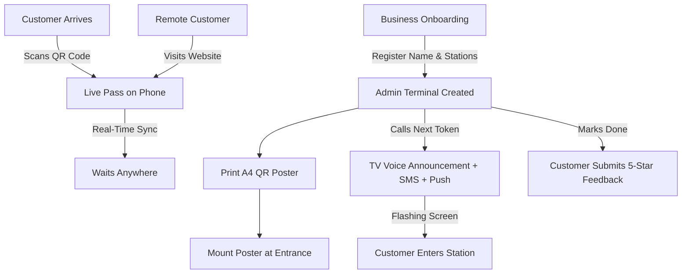

# 📘 noQ — Complete Feature List & Layman User Guide
> **Official Live App**: [https://noq-serve.vercel.app/](https://noq-serve.vercel.app/)  
> **System Type**: Zero-Hardware Intelligent Virtual Queue & Crowd Flow Engine

---

## 🌟 Table of Contents
1. [Introduction to noQ](#1-introduction-to-noq)
2. [Core Concepts Explained Simply](#2-core-concepts-explained-simply)
3. [Exhaustive Feature Breakdown (Points & Subpoints)](#3-exhaustive-feature-breakdown-points--subpoints)
   - [1. Instant QR Code Queue Entry (Scan & Join)](#1-instant-qr-code-queue-entry-scan--join)
   - [2. Zero-Install Mobile Live Digital Pass](#2-zero-install-mobile-live-digital-pass)
   - [3. Remote Web Booking & Time Slot Scheduling](#3-remote-web-booking--time-slot-scheduling)
   - [4. Multi-Doctor & Multi-Station Parallel Calling Engine](#4-multi-doctor--multi-station-parallel-calling-engine)
   - [5. Operator Control Dashboard (Admin Terminal)](#5-operator-control-dashboard-admin-terminal)
   - [6. Multi-Branch Clinic Linkage & Patient Transfer Network](#6-multi-branch-clinic-linkage--patient-transfer-network)
   - [7. Smart Waitlist & Skipped Guest Recall System](#7-smart-waitlist--skipped-guest-recall-system)
   - [8. Lounge TV Screen Display Board with Voice Announcements](#8-lounge-tv-screen-display-board-with-voice-announcements)
   - [9. Print-Ready A4 Venue QR Poster Generator](#9-print-ready-a4-venue-qr-poster-generator)
   - [10. Multi-Channel Notification Engine (SMS, Web Push, WhatsApp)](#10-multi-channel-notification-engine-sms-web-push-whatsapp)
   - [11. Dynamic Industry Lexicon & Domain Adapter](#11-dynamic-industry-lexicon--domain-adapter)
   - [12. Operations Analytics, Heatmaps & CSV Data Export](#12-operations-analytics-heatmaps--csv-data-export)
   - [13. Privacy, Data Protection & PII Security](#13-privacy-data-protection--pii-security)
4. [Step-by-Step User Workflows](#4-step-by-step-user-workflows)
5. [Frequently Asked Questions (FAQ)](#5-frequently-asked-questions-faq)
6. [Comprehensive Troubleshooting Guide](#6-comprehensive-troubleshooting-guide)
7. [Glossary of Terms](#7-glossary-of-terms)

---

## 1. Introduction to noQ

### What is noQ?
**noQ** is a modern, cloud-based virtual queue management system designed to eliminate physical waiting lines, crowded waiting rooms, and confusing paper token slips. 

Instead of forcing patients, diners, or customers to stand in line or sit in cramped waiting areas for hours:
- Customers simply **scan a QR code** or **book a slot online**.
- They receive a **Live Digital Pass** on their smartphone browser (no app download required).
- They can walk around, grab coffee, or wait in their car while watching their live queue position, estimated wait time, and room/station assignment.
- When it's their turn, noQ alerts them via **Lock-Screen Push Notifications**, **SMS**, **WhatsApp**, and **Lounge TV Voice Announcements**.

### Who is noQ for?
- **Healthcare & Clinics**: Doctors, OPDs, dental offices, diagnostic labs, hospitals.
- **Restaurants, Cafes & Bars**: Hostess desks, dining waitlists, food pickup counters.
- **Salons, Spas & Barbers**: Stylist appointment queues, walk-in hair and beauty services.
- **Retail, Banks & Service Centers**: Customer service desks, repair centers, checkout counters.

---

## 2. Core Concepts Explained Simply

| Concept | Plain English Explanation |
| :--- | :--- |
| **Queue Stream** | The central digital line for your business or doctor. Each branch or service has a unique stream. |
| **Digital Pass (`/t/[tokenId]`)** | A web-based ticket that opens instantly on any smartphone browser without installing anything from the App Store or Google Play. |
| **Station / Counter** | The physical location where service takes place (e.g., *Doctor Room 1*, *Stylist Chair 3*, *Table 4*, *Counter 2*). |
| **Access Channel** | How the customer joined the queue: `PHYSICAL_QR` (scanned on-site), `REMOTE` (booked online), or `WALK_IN` (entered manually by front desk). |
| **Fair Priority Recall** | A smart algorithm that re-inserts late or skipped customers near the front of the queue without putting them all the way at the back or unfairly skipping existing on-time guests. |
| **Multi-Branch Linkage** | Connecting two or more clinics or branches owned by the same business so staff can switch views in 1 tap and transfer patients seamlessly. |

---

## 3. Exhaustive Feature Breakdown (Points & Subpoints)

---

### 1. Instant QR Code Queue Entry (Scan & Join)
*Allows on-site visitors to join the queue in 5 seconds using their phone camera.*

- **Zero App Download Required**:
  - Works on standard iOS Camera and Android Google Lens.
  - Opens instantly in Safari, Chrome, Samsung Internet, Firefox, or any mobile browser.
- **Minimal Data Input**:
  - Customer only enters their Name and Mobile Phone Number.
  - Automatically remembers returning visitors on the same browser.
- **Instant Digital Pass Issuance**:
  - Generates a unique sequential token number (e.g., Token `#14`).
  - Immediately redirects customer to their live interactive pass.
- **SMS Confirmation with Direct URL**:
  - Automatically dispatches an SMS text message to the customer's phone containing a direct link back to their pass.

---

### 2. Zero-Install Mobile Live Digital Pass
*The customer's personal live dashboard on their smartphone (`/t/[tokenId]`).*

- **Live Position & Spots Ahead Tracker**:
  - Displays large, clear token number (e.g., `#12`).
  - Shows real-time badge: *"3 spots ahead of you"*.
  - Live animated pulsating indicator showing queue activity.
- **Dynamic Estimated Time of Arrival (ETA)**:
  - Real-time countdown timer calculating remaining wait time based on actual average consultation speed.
  - Formats smartly as minutes (e.g., `25 min`) or hours (e.g., `1 hr 15 min`).
- **Station & Room Calling Banner**:
  - When called, the screen flashes emerald green with high-visibility banner: *"NOW SERVING — Please proceed to Doctor Room 2"*.
  - Plays an audible turn chime on the customer's smartphone.
- **Lock-Screen Web Push Notifications**:
  - One-tap button: `🔔 Enable Lock-Screen Turn Alerts`.
  - Sends OS notifications directly to phone lock screens even when the browser tab is closed.
- **Overrun & Delay Warnings**:
  - If a consultation runs longer than normal, an amber notice appears: *"⚠️ Session running slightly over time (+10m)"*.
- **Self-Serve Queue Cancellation**:
  - `Cancel Token` button allows guests who need to leave early to surrender their ticket with 1 click, freeing up queue space for others.
- **Self-Serve Reschedule Request**:
  - Customers who cannot make it can pick a preferred future date and time slot (`10:00 AM`, `02:30 PM`, etc.) directly from their pass.
- **5-Star CSAT Customer Satisfaction Rating & Google Maps Review Redirection**:
  - Upon session completion, an interactive 5-star rating widget appears with optional text review for instant service feedback.
  - **Automated Google Maps Redirection**: If the business added their Google Maps Review URL (configured easily at onboarding or in dashboard settings), customers who submit their rating are automatically redirected to the business's official Google Maps review profile to leave a public 5-star review.
  - A prominent *"⭐ Share Review on Google Maps ↗"* action card remains accessible so customers can post their review anytime.
- **Location & Google Maps Integration**:
  - Quick button to view venue address and get driving directions in Google Maps or Apple Maps.

---

### 3. Remote Web Booking & Time Slot Scheduling
*Enables customers to book from home before arriving (`/book/[streamId]`).*

- **Dual Booking Modes**:
  - **⚡ Join Live Queue Now**: Instantly grabs the next available token in today's active line from anywhere.
  - **📅 Advance Time Slot**: Lets users pick a specific appointment time from dynamically generated slots (e.g., `09:30 AM`, `11:00 AM`, `04:30 PM`).
- **Live Waiting Line Preview**:
  - Shows how many people are currently waiting and estimated wait time before the user commits.
- **Operating Hours & Days Enforcement**:
  - Automatically restricts bookings to valid business hours and open operating days.
- **Broadcast Notice Visibility**:
  - Any emergency announcement or holiday notice set by the business appears at the top of the booking page.

---

### 4. Multi-Doctor & Multi-Station Parallel Calling Engine
*Empowers venues with multiple rooms, doctors, or counters to serve customers in parallel without confusion.*

- **Parallel Non-Blocking Queues**:
  - Doctor Room 1 and Doctor Room 2 can call and serve Token `#15` and Token `#16` simultaneously.
  - Calling a token at one counter does **not** override or cancel the active session at another counter.
- **Station-Specific Routing**:
  - Every called token is explicitly tagged with its designated station (e.g., `Exam Bed 1`, `Stylist Chair 3`, `Host Station 2`).
  - The assigned station is synchronized across the Customer Live Pass, Operator Dashboard, TV Screen, and Voice Announcement.
- **Customizable Station Counts**:
  - Configurable during onboarding or stream settings (e.g., 3 Doctor Rooms + 2 Exam Beds).

---

### 5. Operator Control Dashboard (Admin Terminal)
*The central control room for front desk staff, receptionists, and doctors (`/dashboard`).*

- **One-Click "Call Next" Action**:
  - Scoped counter picker allows the operator to select their station and summon the next waiting guest in under 1 second.
  - Automatically marks the previously serving guest as completed.
- **Manual Walk-In Entry**:
  - Quick popup modal to register guests who do not have a smartphone or arrive without scanning.
- **Dynamic Service Pace Controller**:
  - `+5 Min Extra Time` quick button when a consultation is taking longer than expected.
  - Interactive **NumberSlider** to adjust base service pace from 2 to 120 minutes.
- **Real-Time Live Broadcast Ticker**:
  - Type an announcement (e.g., *"Doctor delayed by 15 mins due to emergency"*) to instantly broadcast it across all customer passes and TV screens.
- **Direct WhatsApp Dispatcher**:
  - Single-click green WhatsApp button generates a pre-formatted turn reminder message with customer name and token number ready to send via WhatsApp Web/App.
- **Queue State Filters & Search Bar**:
  - Real-time search by customer name or token number.
  - Filter view by Waiting, Serving, Completed, and Skipped.
- **Admin PIN Protection & Session Security**:
  - 6-digit PIN authentication prevents unauthorized access.
  - Issues cryptographic session token for secure administrative actions.
- **Accessibility Modes**:
  - **High-Contrast Theme**: Maximizes black-and-white contrast for low-vision operators.
  - **Large Typography Mode**: Enlarges text and touch targets for tablets and touchscreens.

---

### 6. Multi-Branch Clinic Linkage & Patient Transfer Network
*Allows doctors and healthcare organizations with multiple locations to network their clinics.*

- **Secure Inter-Branch Pairing (`/api/branch/link`)**:
  - Link separate branch streams (e.g., *South Mumbai Clinic* & *Navi Mumbai Branch*) using the target branch's Stream ID and Admin PIN.
- **1-Tap Branch Queue Switching**:
  - Operator can switch between branch dashboards with a single tap from the dashboard header without re-logging in.
- **Cross-Branch Patient Transfer (`/api/branch/transfer`)**:
  - If a patient arrives at Branch A but needs specialized care at Branch B, the operator can transfer them with 1 click.
  - Automatically cancels the ticket at Branch A and generates a new token at Branch B.
  - Dispatches an SMS alert to the patient notifying them of their new token and destination branch.

---

### 7. Smart Waitlist & Skipped Guest Recall System
*Manages late arrivals, no-shows, and appointment reschedules (`/dashboard/waitlist`).*

- **Waitlist / Skip Absent Guests**:
  - If Token `#7` does not show up when called, receptionist clicks `Waitlist / Skip`.
  - Moves them out of the active serving slot without deleting their record, allowing the queue to keep moving.
- **Fair Priority Re-Insertion Algorithm**:
  - When the late guest finally arrives at the desk, receptionist clicks `Re-Queue Fairly`.
  - Instead of forcing them to the very end of the line (e.g., behind 20 new people) or unfairly placing them at the very front, noQ inserts them smoothly at the midpoint of the current waiting queue.
- **Reschedule Request Approval & Rejection Hub**:
  - View incoming reschedule requests submitted by customers from their live pass.
  - Review requested date and time slot.
  - **Approve**: Automatically issues a new token for that time and sends confirmation SMS.
  - **Reject**: Sends a polite notice SMS with optional reason note so the customer can pick another slot.

---

### 8. Lounge TV Screen Display Board with Voice Announcements
*A full-screen, high-visibility waiting room display for TVs and monitors (`/display/[streamId]`).*

- **Multi-Station Active Serving Grid**:
  - Large, bold display of active token numbers alongside their assigned stations (e.g., `Token #22 → Doctor Room 1`, `Token #23 → Doctor Room 2`).
- **Next 5 Upcoming Tokens Waitlist**:
  - Compact sidebar showing the next tokens in line so visitors in the room know when they are up next.
- **Automated Voice Text-to-Speech (TTS) Announcements**:
  - Automatically speaks announcements in natural English using Web Speech API:
    > *"Attention please. Token number 15, please proceed to Doctor Room 2."*
  - Requires zero extra software or hardware—runs directly inside any Smart TV browser or connected PC.
- **Live Broadcast Announcement Ticker**:
  - Scrolling marquee banner at the bottom of the TV screen for venue notices and delay alerts.
- **Fullscreen & High Contrast Controls**:
  - One-tap toggle for clean borderless TV display.

---

### 9. Print-Ready A4 Venue QR Poster Generator
*Generates professional on-site signage ready to print and mount (`/dashboard/poster`).*

- **Vector-Crisp High-Resolution QR Code**:
  - Embeds the exact direct scan URL for your venue queue.
- **Clear Layman Instructions**:
  - Step-by-step visual guide: *"1. Scan QR Code → 2. Get Live Pass → 3. Walk In When Called"*.
- **1-Click Browser Print Trigger**:
  - Auto-configured CSS print media stylesheet formats cleanly on standard A4 / US Letter paper without printing unwanted headers or buttons.
- **Branded & Verified**:
  - Includes venue name and verified link to `https://noq-serve.vercel.app/`.

---

### 10. Multi-Channel Notification Engine (SMS, Web Push, WhatsApp)
*Ensures customers never miss their turn regardless of their device or connectivity.*

- **httpSMS Android SIM Cellular Gateway**:
  - Direct integration with httpSMS Android app to send real SMS text messages using an on-premise Android SIM card at local operator plan rates (zero third-party SMS markups).
- **VAPID Native Web Push Service Worker**:
  - Industry-standard Web Push protocol that delivers lock-screen notifications to Android (Chrome) and iOS 16.4+ (Safari).
- **Pre-Configured WhatsApp Alerts**:
  - Instant click-to-chat links for receptionists to notify customers directly on WhatsApp.

---

### 11. Dynamic Industry Lexicon & Domain Adapter
*Adapts the entire system vocabulary to match your specific industry automatically.*

| Domain | Guest Term | Provider Term | Pace Term | Queue Title | Default Stations |
| :--- | :--- | :--- | :--- | :--- | :--- |
| **Healthcare / Clinic** | Patient | Doctor / Specialist | Consultation Pace | Main OPD Queue | Doctor Room 1, Exam Bed 1 |
| **Restaurant / Cafe** | Diner / Guest | Table / Server | Table Turn Pace | Dining Waiting List | Host Station 1, Express Pickup 1 |
| **Salon / Spa** | Client | Stylist / Specialist | Service Duration | Styling & Service Queue | Stylist Chair 1, Wash Station 1 |
| **Retail / Banking** | Customer | Service Counter | Service Pace | Main Service Queue | Counter 1, Counter 2 |

---

### 12. Operations Analytics, Heatmaps & CSV Data Export
*Actionable business intelligence for managers and owners (`/dashboard/analytics`).*

- **Key Performance Indicators (KPIs)**:
  - Total tokens issued, completed count, skipped count, cancelled count.
  - Overall completion rate percentage and average service time in minutes.
- **Hourly Peak Traffic Heatmap**:
  - Visual 24-hour bar chart highlighting peak rush hours to assist with staff scheduling.
- **Access Channel Breakdown**:
  - Pie/bar distribution showing the percentage of guests arriving via On-Site QR vs Remote Web Booking vs Walk-In.
- **Real-Time Customer Satisfaction (CSAT) & Feedback**:
  - Average star rating calculation and recent verified customer text comments.
- **1-Click Structured CSV Data Export**:
  - Generates downloadable `.csv` report with token numbers, guest names, masked phone numbers, access channels, timestamps, and status for audit and reporting.

---

### 13. Privacy, Data Protection & PII Security
*Enterprise-grade privacy protections for sensitive customer data.*

- **Automatic PII Phone Masking**:
  - Publicly accessible APIs and displays automatically mask customer phone numbers (e.g., `+91 •••••• 4512`).
- **Customer Name Privacy Abbreviation**:
  - Displays customer names in public waiting areas as `John D.` or `J***n` to comply with healthcare and privacy standards.
- **HMAC-SHA256 Cryptographic Session Tokens**:
  - Protects privileged actions (calling next, skipping, changing settings) with secure, expiring admin session tokens.

---

## 4. Step-by-Step User Workflows

### Workflow A: Quick 60-Second Setup for Business Owners
1. Visit [https://noq-serve.vercel.app/](https://noq-serve.vercel.app/) and click **"Register Business / Launch Terminal"**.
2. Enter your business name (e.g., *Apex Dental Care*), select your industry (e.g., *Clinic*), and choose your stations (e.g., 2 Doctor Rooms).
3. Set your 6-digit Admin PIN and service pace.
4. Click **Create Queue Terminal** — your dashboard is live immediately!
5. Navigate to **Printable QR Poster** (`/dashboard/poster`), print the page, and place it at your front desk.

### Workflow B: The Customer Journey
1. **Joining the Queue**: Customer opens their phone camera and scans the poster QR code.
2. **Entering Info**: Customer enters their name and phone number on the web screen.
3. **Tracking**: The customer sees Token `#12`, with 3 spots ahead of them and an estimated 15-minute wait.
4. **Freedom to Move**: Customer relaxes at a nearby cafe or in the lobby.
5. **Turn Alert**: When called, their phone vibrates, displays a push notification, and the pass screen turns green: *"Please proceed to Doctor Room 1"*.
6. **Completion**: After their consultation, the customer taps 5 stars to rate their experience.

### Workflow C: Front Desk Operator Routine
1. Open the **Operator Dashboard** on a tablet, laptop, or desktop.
2. When ready for the next patient, select your station (e.g., *Doctor Room 1*) and tap **"CALL NEXT"**.
3. If a patient is not present, tap **"Waitlist / Skip"** to proceed to the next patient without deleting the absent patient's record.
4. When the late patient arrives, open the **Smart Waitlist** tab and tap **"Re-Queue Fairly"**.

---

## 5. Frequently Asked Questions (FAQ)

### General Questions

#### Q1: Do customers or patients need to install an app from Google Play or Apple App Store?
**No.** noQ is 100% web-based. It runs inside standard mobile browsers (Safari, Chrome, Firefox, Edge). Customers simply scan the QR code and their pass opens instantly.

#### Q2: What hardware is required to run noQ?
**Zero specialized hardware.**
- **Front Desk**: Any smartphone, tablet, iPad, laptop, or desktop computer with a web browser.
- **Waiting Lounge TV**: Any Smart TV with a built-in browser, or a TV connected to a Chromecast, Firestick, mini-PC, or HDMI cable.
- **Customers**: Any smartphone with a camera and web browser.

#### Q3: Can noQ handle multiple doctors or service counters at the same time?
**Yes.** noQ is built specifically for parallel multi-station operations. Doctor Room 1 and Doctor Room 2 can call, serve, and complete patients simultaneously without interfering with one another.

---

### Notifications & Connectivity

#### Q4: How do Lock-Screen Push Notifications work if the customer closes their browser tab?
noQ utilizes standard Web Push (VAPID) service workers. Once the customer taps *"Enable Turn Alerts"*, notifications are delivered to the operating system notification tray (Android and iOS 16.4+) even if the browser tab is closed.

#### Q5: How does SMS sending work?
noQ supports the **httpSMS Android Gateway**, allowing businesses to connect an on-premise Android phone with a local SIM card to dispatch real cellular SMS messages without paying expensive per-SMS API markups.

#### Q6: What happens if a customer has an older phone or no internet connection?
The front desk can enter them manually using the **"Add Walk-in"** button. The customer can listen for voice announcements on the lounge TV or watch the large TV display board.

---

### Operational Scenarios

#### Q7: What if a customer does not show up when their number is called?
Do not delete their ticket. Tap **"Waitlist / Skip"**. This moves them aside so other waiting guests are not delayed. When they arrive later, go to the **Waitlist** tab and tap **"Re-Queue Fairly"** to insert them smoothly into the queue.

#### Q8: Can a doctor who operates clinics in multiple locations link their branches?
**Yes.** Using the **Multi-Branch Network** feature, you can link Branch A and Branch B using their Stream ID and PIN. You can toggle between branches in 1 tap and transfer patients between clinics with automated SMS notifications.

#### Q9: Can customers reschedule their appointment if they are running late?
**Yes.** From their digital pass, customers can tap *"Request Reschedule"*, choose a preferred date and time slot, and submit. The operator can approve or reject this request with 1 click in the Waitlist manager.

---

## 6. Comprehensive Troubleshooting Guide

### 1. The Customer Live Pass is Not Updating in Real Time
- **Cause**: Network firewall blocking WebSocket connections, or low connectivity.
- **Solution**:
  1. noQ has an automatic 10-second polling fallback if real-time WebSockets are interrupted.
  2. Ensure the device is connected to active mobile data or venue Wi-Fi.
  3. Tap the browser reload button; session state is safely preserved.

### 2. The TV Display is Not Speaking Voice Announcements
- **Cause**: Modern web browsers block automated audio autoplay until a user interacts with the page.
- **Solution**:
  1. Click anywhere on the TV screen or tap the **"🔊 Click to Enable Voice Announcements"** button on the display page.
  2. Ensure TV speakers / volume are unmuted.
  3. Verify that the browser supports the Web Speech API (Chrome, Safari, and Edge support this natively).

### 3. Web Push Notifications Are Not Appearing on iPhone
- **Cause**: iOS requires iOS version 16.4 or newer and requires the user to grant notification permissions.
- **Solution**:
  1. Ensure the iPhone is running iOS 16.4 or higher.
  2. Make sure the user taps **"Allow"** when prompted for notification permissions.
  3. Verify that iOS *"Do Not Disturb"* or *"Focus Mode"* is not silencing web notifications.

### 4. Admin PIN is Not Accepted / Locked Out of Dashboard
- **Cause**: Incorrect PIN entered or expired session token.
- **Solution**:
  1. Use the 6-digit PIN set during business onboarding (Default fallback: `123456`).
  2. Clear browser session storage or open the dashboard in an incognito window to re-trigger the PIN prompt.

### 5. Printable Poster QR Code Does Not Scan Properly
- **Cause**: Low printer ink or insufficient lighting.
- **Solution**:
  1. Print the poster in high contrast / black & white at 100% scale (A4 / Letter size).
  2. Ensure the printed QR code is not smudged or wrinkled.
  3. Verify that the mobile phone camera lens is clean and has adequate ambient lighting.

---

## 7. Glossary of Terms

- **Ably Realtime**: The low-latency cloud synchronization engine that updates all screens within milliseconds without requiring page refreshes.
- **CSAT (Customer Satisfaction Score)**: A 1-to-5 star rating submitted by customers after their service is completed.
- **Dynamic ETA**: The continuously recalculated estimated wait time based on how fast consultations are proceeding.
- **Fair Priority Algorithm**: A mathematical midpoint re-queue calculation that places returned latecomers into an equitable queue position.
- **httpSMS**: A gateway service connecting Android SIM cards to web applications for local-rate SMS dispatch.
- **PII (Personally Identifiable Information)**: Sensitive customer data (e.g., phone numbers and full names) protected and masked by noQ.
- **Stream ID**: The unique alphanumeric identifier for a specific venue or clinic queue.
- **TTS (Text-to-Speech)**: Synthetic voice engine that converts written token callouts into spoken announcements on waiting room TVs.
- **VAPID Web Push**: Standard protocol for sending push notifications directly to mobile operating system lock screens from web apps.

---

*Official Portal: [https://noq-serve.vercel.app/](https://noq-serve.vercel.app/)*  
*© 2026 noQ Systems. All Rights Reserved.*
